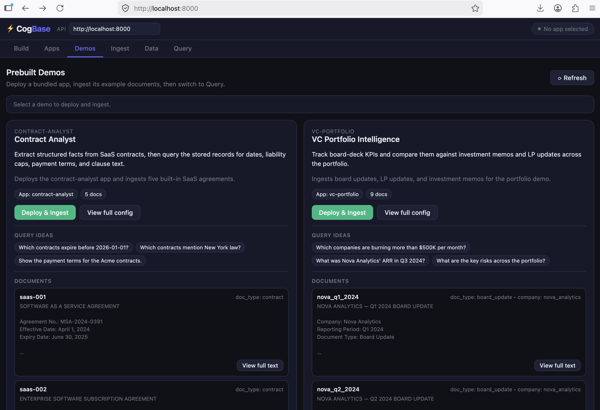

# CogBase

**Generate. Ingest. Reason. Evolve.**

Build AI apps from a plain-language description. Ingest anything. Extract structured facts. Reason across all of it. Get smarter with every query.

CogBase is an open-source framework for building AI applications that need to understand, cross-reference, and reason over large volumes of documents — contracts, emails, reports, transcripts, filings, and more.

It provides the foundational layer that vertical AI products are built on: a knowledge pipeline, composable workflows, a skill registry, a multi-tier memory system, and an adaptive evolution engine — generated from a plain-language description, deployed through a REST API, and improved by every query.

**[▶ Watch the demo - App Auto Creation](https://youtu.be/OMRFF5oauEk)**

**[▶ Watch the demo - Get Trusted Answer Fast over your documents](https://youtu.be/N5Vip3jwiEk)**

---

## Benchmarks

Competitive with purpose-built systems on public benchmarks.

| Benchmark | Task | CogBase | Comparison |
|---|---|---|---|
| [LoCoMo](https://github.com/snap-research/locomo) | Conversational memory | **93.9%** memory mode / 92.8% baseline (June 2026) | Mem0 91.6% (Apr 2026) |
| [GraphRAG-Bench](https://graphrag-bench.github.io/) (Medical) | Document QA | **74.46** with extraction pipeline | above top leaderboard entry (73.30) |
| [GraphRAG-Bench](https://graphrag-bench.github.io/) (Medical) | Document QA | 72.94 simple chunking | 2nd on leaderboard (leader 73.30) |
| [GraphRAG-Bench](https://graphrag-bench.github.io/) (Novel) | Document QA | 58.62 simple chunking | 3rd on leaderboard (leaders 63.72 / 58.94) |
| [GraphRAG-Bench](https://graphrag-bench.github.io/) (Novel) | Document QA | **60.18** self-distilled (full Novel) · **66.56** gold-memory ceiling (5 corpora) | +1.56 over 58.62 simple chunking |

On **[GraphRAG-Bench](https://graphrag-bench.github.io/) Medical**, CogBase's **structured-extraction pipeline scores 74.46 — above the top leaderboard entry (73.30)** — the same extraction + workflow layer that sets CogBase apart from plain chunk-and-retrieve RAG, with the app config generated from a natural-language description — no hand-authored schema, and no purpose-built, hand-maintained knowledge graph. Even simple chunking alone places CogBase 2nd–3rd across subsets.

On **Novel**, adding the long-term memory layer lifts answer correctness above simple chunking. **Self-distilled memory — built from the system's own prior answers, no ground truth — scores 60.18 on the full Novel subset (+1.56 over the 58.62 baseline).** Distilling ground-truth answers instead marks the ceiling at **66.56** on a 5-corpus set, showing how much memory can add when what it stores is correct. Gold memory simulates the case where an admin fixes or improves the answers to some questions, and those corrections are distilled back into memory for future queries.

Details: [benchmarks/graphrag/README.md](benchmarks/graphrag/README.md) · [benchmarks/locomo/README.md](benchmarks/locomo/README.md).

---

## The problem

**Your AI says "I don't know" — or worse, gives a partial answer — when the full answer is in the documents.**

With a well-designed AI system, the model correctly says "I don't know" rather than hallucinating. That's progress. But IDK is still the wrong answer when the information is sitting right there in your files — and a confident-sounding partial answer (the 3 contracts that happened to retrieve, not the 12 that match) is more dangerous, because the user has no way to tell what got missed. The problem isn't the LLM — it's the retrieval architecture underneath it.

- **Structured facts are buried in prose.** Timelines, numerical thresholds, dates, parties, obligations — they're all in the documents, readable by any human who opens the file. But vector search retrieves semantically similar chunks, not typed facts. You ask "which contracts auto-renew before Q3?" and get IDK — or a partial list of whichever contracts happened to surface in the top-k — not because the data doesn't exist, but because renewal dates were never extracted as structured fields. The AI can't reconstruct a timeline or compare figures across 40 documents by searching for similar text.
- **Cross-document reasoning is invisible to retrieval.** "Does this email contradict the contract?" Both documents are indexed. Neither chunk retrieves the other as context. The contradiction is derivable — but only if you hold both in scope simultaneously. Vector search doesn't do that. The model answers from whichever side it saw and never flags the conflict.
- **The data is there — the retrieval architecture can't reach it.** Knowledge graphs are one attempt to solve this. But timelines are a genuine KG weakness — time is awkward to model as nodes and edges. And KGs require significant engineering to construct: define the ontology, disambiguate entities, maintain edges as documents evolve. They don't build themselves, and they don't stay current.
- **Failures are silent and permanent.** When the same question fails 50 times — same IDK, same partial answer, same miss — nothing changes. There's no mechanism that notices "renewal date questions always fail" and surfaces "extract renewal dates as a structured field." Every gap stays invisible. Every failure repeats forever.
- **Query-time token cost scales with raw document volume.** When retrieval surfaces large prose chunks, the LLM processes all of it on every request — token by token, query after query. Multiply by query volume and the cost compounds fast. The real work — extraction, summarization, cross-document reasoning — doesn't need to happen at query time at all. It already happened when the document was ingested.

CogBase addresses each layer: the pipeline extracts typed facts alongside passage chunks and per-document summaries so structured queries and cross-document reasoning are first-class; workflows fan retrieval out across many documents at ingest time so contradictions and comparisons are pre-computed; at query time the LLM sees compact structured records and pre-computed workflow results rather than raw prose — cutting the context window and keeping token spend predictable; skills extend what the agent can do beyond answering; memory gives it continuity across sessions; and the adaptive evolution engine mines failed queries to surface the missing fields, collections, and steps — so the same gap doesn't fail silently forever.

---

## Architecture

CogBase is organized into six layers with clean boundaries between them.

```
╔═══════════════════════════════════════════════════════════╗
║  APP GENERATOR                 (conversational)           ║
║                                                           ║
║  User describes:                                          ║
║    • document types  ("SaaS contracts, vendor emails")    ║
║    • facts that matter  ("parties, payment terms, dates") ║
║    • example questions  ("which vendors auto-renew?")     ║
║          ↓                                                ║
║  LLM generates complete draft config:                     ║
║    vector collections  (passages + summaries)             ║
║    structured collections + extraction schemas + prompts  ║
║    pipeline steps  (chunk, extract, summarise)            ║
║    workflows  (if example questions need fan-out)         ║
║          ↓                                                ║
║  Draft presented → user revises conversationally          ║
║          ↓                                                ║
║  Deploy: POST /namespaces/{namespace}/generate/deploy     ║
╚═══════════════════════════════════════════════════════════╝
          ↓  config.yaml ZIP bundle
╔═══════════════════════════════════════════════════════════╗
║  KNOWLEDGE PIPELINE                        (async)        ║
║                                                           ║
║  Raw inputs                                               ║
║  (PDF, DOCX, email, chat, transcript, ...)                ║
║          ↓                                                ║
║  Ingestion & parsing                                      ║
║          ↓                                                ║
║  Steps run in order:                                      ║
║    chunk-embed-upsert     → passage chunks + embeddings   ║
║    extract-structured     → typed records via LLM         ║
║    document-embed-upsert  → one vector/doc like summary   ║
║          ↓                ↓                ↓              ║
║  ┌──────────────────┐  ┌──────────────────────────────┐   ║
║  │ Structured Store │  │       Vector Store           │   ║
║  │ (typed records,  │  │ document_chunks (passages)   │   ║
║  │  schemas, facts) │  │ document_summary (per-doc)   │   ║
║  └──────────────────┘  └──────────────────────────────┘   ║
╚═══════════════════════════════════════════════════════════╝
          ↕  structured-query / vector-search / structured-save
╔═══════════════════════════════════════════════════════════╗
║  WORKFLOWS                         (on-demand)            ║
║                                                           ║
║  API call  ──or──  after_ingest trigger                   ║
║          ↓                                                ║
║  Sequential steps over ingested collections:              ║
║    structured-query   → read typed records                ║
║    vector-search      → semantic retrieval                ║
║    llm-structured     → LLM judge / classifier            ║
║    structured-save    → write derived records + SSE       ║
║          ↓                                                ║
║  Derived records land in output_collections               ║
╚═══════════════════════════════════════════════════════════╝
          ↕  hybrid retrieval tools
╔═══════════════════════════════════════════════════════════╗
║  QUERY RUNNER                              (real-time)    ║
║                                                           ║
║  User query                                               ║
║          ↓                                                ║
║  LLM agent loop                                           ║
║    ├── structured_lookup tool  (exact records)            ║
║    ├── vector_search tool      (passages or summaries)    ║
║    ├── read_document tool      (slice text by char offset)║
║    └── skill tools             (custom capabilities)      ║
║          ↓                                                ║
║  Grounded, cited response                                 ║
╚═══════════════════════════════════════════════════════════╝
          ↕  reads/writes
╔═══════════════════════════════════════════════════════════╗
║  MEMORY LAYER                              (persistent)   ║
║                                                           ║
║  Short-term  →  in-memory projection over the log         ║
║               (session context; rehydrates on miss)       ║
║                                                           ║
║  Episodic    →  Log Store (append-only NDJSON)            ║
║               (per-session event log; source of truth)    ║
║                                                           ║
║  Long-term   →  Structured Store + Vector Store           ║
║               (distilled cross-session facts, prefs,      ║
║                corrections, hints; linked memory graph)   ║
╚═══════════════════════════════════════════════════════════╝
          ↕  reads episodic history
╔═══════════════════════════════════════════════════════════╗
║  ADAPTIVE EVOLUTION                     (background)      ║
║                                                           ║
║  Gap detector mines episodic logs:                        ║
║    • low vector scores     → missing collection or step   ║
║    • repeated null answers → missing structured field     ║
║    • recurring tool chains → candidate skill              ║
║          ↓                                                ║
║  Suggestion queue: user confirms, adjusts, or rejects     ║
║          ↓  on acceptance                                 ║
║  Config patched → targeted re-ingest → app updated        ║
║          ↺  feeds back to App Generator                   ║
╚═══════════════════════════════════════════════════════════╝
```

See [docs/architecture.md](docs/architecture.md) for a detailed walkthrough of each layer.

---

## Project structure

```
cogbase/
├── cogbase/
│   ├── pipeline/     # chunking, LLM extraction, ingestion pipeline
│   ├── stores/       # structured + vector + document store adapters
│   ├── skills/       # skill interface + registry
│   ├── workflows/    # workflow engine
│   └── core/         # CogBaseApp, Runner, Session, AppGenerator
├── api/              # FastAPI REST API + config schema
└── examples/         # demo applications (contract, compliance, VC, legal case)
```

---

## Core Concepts

- **App generator** — describe your documents and questions in plain language; the system generates the full `config.yaml`
- **Knowledge pipeline** — chunk-embed, extract structured facts, and summarize at ingest time; pluggable store backends
- **Workflows** — YAML-declared analytical pipelines with `foreach` loops and `after_ingest` triggers
- **Query runner** — LLM agent loop with `structured_lookup`, `vector_search`, `read_document` (broader context around a hit), and skill tools; no fixed routing pattern
- **Memory** — short-term (session), episodic (history), and long-term (cross-session) tiers
- **Adaptive evolution** — gap detector mines usage logs to surface concrete config improvement suggestions
- **Skills** — discrete, stateless custom capabilities registered per application

See [docs/concepts.md](docs/concepts.md) for details on each capability.

---

## Why no knowledge graph?

CogBase uses a vector store + structured store + LLM agent loop rather than an explicit knowledge graph. The LLM issues iterative retrieval calls — seeing entities in one result and issuing follow-up searches — which approximates graph traversal for 2–4 hops without the upfront engineering and model cost of building and maintaining a graph. The memory layer learns successful retrieval paths across sessions, and the adaptive evolution engine materializes frequently-traversed cross-references into the structured store; together they close most of the remaining gap. The cases where a KG remains the right tool — exhaustive completeness guarantees, 6+ hop traversal at scale, global graph algorithms — are real but narrow, and do not describe most enterprise document AI workloads.

See [docs/knowledge-graph-decision.md](docs/knowledge-graph-decision.md) for the full analysis.

---

## Quickstart

Uses SQLite + FAISS — no external databases required. You need Docker and an OpenAI API key.

```bash
export OPENAI_API_KEY=sk-...
docker run -p 8000:8000 -e OPENAI_API_KEY junius/cogbase-demo:latest
```

Open `http://localhost:8000` to access the demo UI.



See [`server/README.md`](server/README.md) for persistence details and how to reset to a clean state.

### Option A: Try a built-in demo app

Open the **Demos** tab, select an example, and click **Deploy & Ingest** to deploy the app and load sample documents. Three domains are included:

- [`examples/contract_analyst_demo/`](examples/contract_analyst_demo/) — Legal contract extraction + Q&A
- [`examples/contract_compliance_demo/`](examples/contract_compliance_demo/) — Compliance-rule checking across contracts
- [`examples/vc_portfolio_demo/`](examples/vc_portfolio_demo/) — VC portfolio company analysis
- [`examples/legal_case_prep_demo/`](examples/legal_case_prep_demo/) — Case bundle ingestion (pleadings, evidence, depositions) with structured fact extraction

Each is a starting point — copy, adapt, and redeploy via the REST API.

### Option B: Create your own application

Open the **App Generator** tab, describe your documents and the questions you want to answer, and CogBase generates and deploys the config. Then upload documents and start querying.


## REST API

See [docs/api.md](docs/api.md) for the full REST API endpoint reference.

---

## Use cases

CogBase is not limited to legal. The core architecture maps to any domain where professionals spend significant time reading, cross-referencing, and drafting from large heterogeneous data sets.

| Vertical | Input data | Core value |
|---|---|---|
| Legal | Contracts, emails, depositions, filings | Contradiction detection, timeline, draft motions |
| Insurance claims | Medical records, police reports, policy docs | Coverage gap detection, settlement drafting |
| M&A due diligence | Contracts, financials, IP filings, HR records | Risk surfacing, diligence memo generation |
| Financial compliance | Transaction records, policies, communications | Policy violation detection, audit reports |
| Medical records review | EHR notes, lab results, imaging reports, referrals | Drug conflict detection, care summary drafting |
| Academic / patent research | Papers, patents, citations | Prior art timelines, claim contradiction analysis |

About 90% of the codebase — the ingestion pipeline, workflow engine, query runner, skill registry, memory layer, and store interfaces — is identical across all verticals. You write the config and schema once. The store adapters handle the rest.

---

## Roadmap

**Implemented**
- [x] Core ingestion pipeline (chunk-embed-upsert, extract-structured, document-embed-upsert)
- [x] Typed fact extraction with configurable JSON schema
- [x] Store adapter interfaces (StructuredStoreBase, VectorStoreBase)
- [x] Built-in adapters: SQLite, Postgres, FAISS, pgvector
- [x] Per-document summarization vector collection
- [x] LLM agent query loop with structured_lookup, vector_search, and read_document tools
- [x] Skill registry + base skill interface
- [x] REST API (create/update/delete apps, ingest, query, streaming)
- [x] Declarative workflow engine (structured-query, vector-search, llm-structured, structured-save; foreach; after_ingest)
- [x] Native document parsing (PDF, DOCX, HTML ingestion)
- [x] App generator (conversational config generation from description + example questions, with iterative revision)
- [x] Docker Compose quickstart (SQLite + FAISS, see `server/`)
- [x] Contract analyst, contract compliance, VC portfolio, and legal case prep examples
- [x] Document registry — per-app document tracking with status (`PENDING`, `RUNNING`, `DONE`, `FAILED`)
- [x] Background task tracking — ingest and workflow runs tracked as idempotent `TaskRecord` entries
- [x] Runtime LLM and embedding configuration — configure providers via `POST /system/config`; no restart required
- [x] OpenAI-compatible provider support — any base URL works for LLM and embeddings
- [x] Workflow `params_from_collection` — manual triggers accept `doc_id` and auto-derive params like `after_ingest`
- [x] SQLite schema evolution — detects and repairs constraint mismatches; no manual migration needed
- [x] Demo UI: tabbed layout (Apps, Build, Ingest, Query, Demos, Data), per-document workflow status, deploy/ingest progress, Settings tab for provider configuration
- [x] AppScope namespacing — all store adapters scope collections by app name, preventing conflicts between apps on a shared backend
- [x] Multi-tenancy — every request carries an `account_id` (`X-Account-Id` header, the tenant/security boundary) and a `namespace_id` (`{namespace}` URL segment, an in-account organizational unit); apps are unique by `(account_id, namespace_id, name)` and name-addressed routes live under `/namespaces/{namespace}/applications`
- [x] Full app deletion cleanup — vector/structured collections, document store entries, and system store records are all removed on `DELETE /namespaces/{namespace}/applications/{name}`
- [x] LLM token usage — `input_tokens` and `output_tokens` counted across all LLM calls and returned in query responses (blocking and streaming)
- [x] Query-time and app-level `system_prompt` — override the default system prompt per request via `QueryRequest.system_prompt`, or set a default in `config.yaml`
- [x] `top_k` configurable in `QueryRequest` for per-request result tuning
- [x] Sentence-boundary chunking — Langchain chunker splits at sentence boundaries (`.`, `。`) instead of mid-word or mid-sentence; Chinese text supported
- [x] Short-term memory — in-memory projection over the episodic log tail; rehydrates on cache miss, compacts under model-context pressure (`session_compacted`)
- [x] Episodic memory — durable append-only per-session event log (`LogStoreBase`, NDJSON), the single source of truth for short-term and distillation
- [x] Long-term memory — offline distillation on session close: extract + reconcile (ADD/UPDATE/DELETE/NOOP) durable facts/preferences/corrections/hints against accumulated belief, linked into a memory graph, recalled into the query runner (with the `memory_lookup` pull tool); LoCoMo: 93.9% vs 92.8% baseline
- [x] Long-document ingestion — all three pipeline steps handle inputs that overflow model limits: `chunk-embed-upsert` batches passages to the embedding API (configurable `batch_size`) and sizes chunks against the embedding `context_window`; `extract-structured` splits oversized documents into overlapping, token-bounded windows, extracts each independently, and merges the results with duplicate removal; `document-embed-upsert` summarizes oversized documents map-reduce (shared `summarize_text` helper, also used by short-term memory compaction)
- [x] Query runner: auto-compaction — when the working message list outgrows `context_token_budget`, the agent loop compacts it in place via `compact_messages` (map-reduce summarization over the transcript, same `summarize_text` helper), bounding token cost across long multi-tool turns; opt-in (off when no budget is set), and safe to trigger between rounds since every tool call has already been answered

**Improvements**

These are known gaps in the first-pass implementations.

- [ ] Skills: skill creator, pull from a registry, add a skill to an app, skill versioning, etc
- [ ] Ingestion: multi-modal inputs (image, audio, video), hierarchical chunking, etc
- [ ] Workflow step timeouts and partial-failure recovery — a failing step currently aborts the whole workflow, parallel steps, etc
- [ ] API layer - authentication (API keys or token-based), etc
- [ ] Broader integration test coverage — especially for query runner loops, workflows, and API end-to-end paths

**Planned**
- [ ] Long-term memory: retention sweep for superseded / stale `pending_review` records; finer `scope` (user/project/org) within the app partition
- [ ] Adaptive evolution engine (gap detector: retrieval score analysis, null-answer mining, tool-chain clustering)
- [ ] Suggestion surface API (GET /suggestions, accept/reject with targeted re-ingest)
- [ ] Document source connectors (Google Drive, etc)
- [ ] Insurance example
- [ ] Medical records example
- [ ] Managed cloud hosting (SOC 2)

**Future**
- [ ] Structured source connectors (CRM, database, API) — connect external systems without document intermediaries

---

## Contributing

CogBase is in early development. The highest-impact contributions right now are improvements to the existing implementations — not new features.

**Harden existing work** (see _Improvements in the roadmap for specifics)
- Fix known gaps in the pipeline, query runner, workflows, and API
- Add integration tests for the query runner loop, workflow execution, and API end-to-end paths
- Try the [quickstart](#quickstart) with real documents and file issues for anything that breaks or behaves unexpectedly

**Extend the framework**
- **Contribute a store adapter** — implement `StructuredStoreBase` or `VectorStoreBase` for a backend not yet supported
- **Contribute an example** — a YAML config + JSON schema + prompt file for a new vertical
- **Contribute a skill** — any stateless capability that implements the skill interface

**Build planned features**
- **Adaptive evolution** — gap detector, suggestion queue, and targeted re-ingest

See [CONTRIBUTING.md](./CONTRIBUTING.md) for guidelines.

---

## License

Apache 2.0
